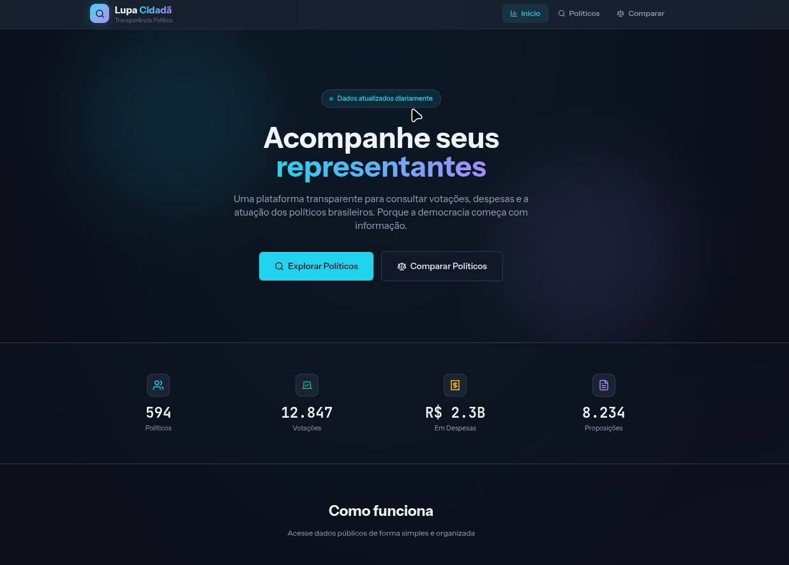
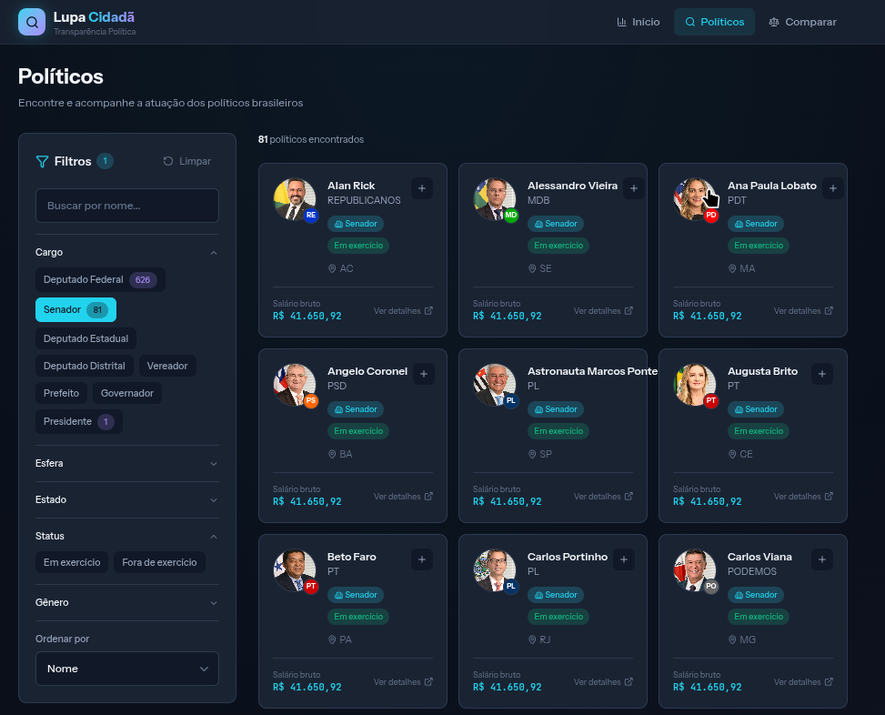

# 🔍 Lupa Cidadã

**Portal de Transparência Política do Brasil**

Uma plataforma moderna e acessível para acompanhar a atuação dos políticos brasileiros. Consulte votações, proposições, despesas e muito mais.


 
 
---

## ✨ Funcionalidades

- 🏛️ **Consulta de Políticos** - Deputados, Senadores, Vereadores e mais
- 📊 **Votações** - Histórico completo de votos em proposições
- 💰 **Despesas** - Gastos detalhados com cota parlamentar
- 📋 **Proposições** - Projetos de lei apresentados e coautorados
- 🎯 **Filtros Avançados** - Por cargo, partido, estado, e muito mais
- ⚖️ **Comparador** - Compare a atuação de múltiplos políticos
- 📈 **Estatísticas** - Presença em votações, produtividade legislativa

---
## 🚀 Quick Start

### Pré-requisitos

- Node.js 18+
- Yarn
- Go 1.21+
- Docker & Docker Compose

### Desenvolvimento Local

```bash
# Clone o repositório
git clone https://github.com/seu-usuario/lupa-cidada.git
cd lupa-cidada

# Inicie os serviços (MongoDB, Redis, Meilisearch)
make db-up

# Instale as dependências
make install

# Inicie o ambiente de desenvolvimento
make dev
```

O frontend estará disponível em `http://localhost:5173` e a API em `http://localhost:8080`.

### Com Docker (Produção)

```bash
# Suba todos os serviços
docker-compose up -d

# Veja os logs
docker-compose logs -f
```

---

## 🏗️ Arquitetura

```
lupa-cidada/
├── frontend/          # React + TypeScript + Vite
│   ├── src/
│   │   ├── components/
│   │   ├── pages/
│   │   ├── hooks/
│   │   ├── services/
│   │   └── stores/
│   └── ...
│
├── backend/           # Go + Echo
│   ├── cmd/api/
│   ├── internal/
│   │   ├── domain/
│   │   ├── handlers/
│   │   ├── repository/
│   │   └── services/
│   └── ...
│
└── docker-compose.yml
```

### Stack

| Componente | Tecnologia |
|------------|------------|
| Frontend | React 18, TypeScript, Vite, Tailwind CSS |
| Backend | Go 1.21, Echo v4 |
| Banco de Dados | MongoDB 7.0 |
| Cache | Redis 7 |
| Busca | Meilisearch |

---

## 📡 API Endpoints

### Políticos

```
GET    /api/v1/politicos          # Lista com filtros e paginação
GET    /api/v1/politicos/:id      # Detalhes de um político
GET    /api/v1/politicos/:id/votacoes    # Votações
GET    /api/v1/politicos/:id/despesas    # Despesas
GET    /api/v1/politicos/:id/proposicoes # Proposições
GET    /api/v1/politicos/:id/presencas   # Presenças
GET    /api/v1/politicos/comparar        # Comparar políticos
```

### Filtros

```
GET    /api/v1/filtros/partidos   # Lista de partidos
GET    /api/v1/filtros/estados    # Lista de estados
GET    /api/v1/filtros/cargos     # Tipos de cargo
```

### Estatísticas

```
GET    /api/v1/estatisticas/geral        # Estatísticas gerais
GET    /api/v1/estatisticas/ranking      # Rankings diversos
```

---

## 📊 Fontes de Dados

Os dados são obtidos de APIs públicas oficiais:

- [Portal de Dados Abertos da Câmara](https://dadosabertos.camara.leg.br/)
- [Portal de Dados Abertos do Senado](https://www12.senado.leg.br/dados-abertos)
- [Portal da Transparência](https://portaldatransparencia.gov.br/)
- [Dados Abertos TSE](https://dadosabertos.tse.jus.br/)

---

## 🤝 Contribuindo

Contribuições são bem-vindas! Por favor, leia nosso guia de contribuição antes de enviar um PR.

1. Fork o projeto
2. Crie sua branch (`git checkout -b feature/nova-funcionalidade`)
3. Commit suas mudanças (`git commit -m 'Adiciona nova funcionalidade'`)
4. Push para a branch (`git push origin feature/nova-funcionalidade`)
5. Abra um Pull Request

---

## 📄 Licença

Este projeto está sob a licença MIT. Veja o arquivo [LICENSE](LICENSE) para mais detalhes.

---

## 🙏 Agradecimentos

- Dados públicos disponibilizados pelo Governo Federal
- Comunidade open source

---

<p align="center">
  Feito com 💚💛 para o Brasil
</p>

